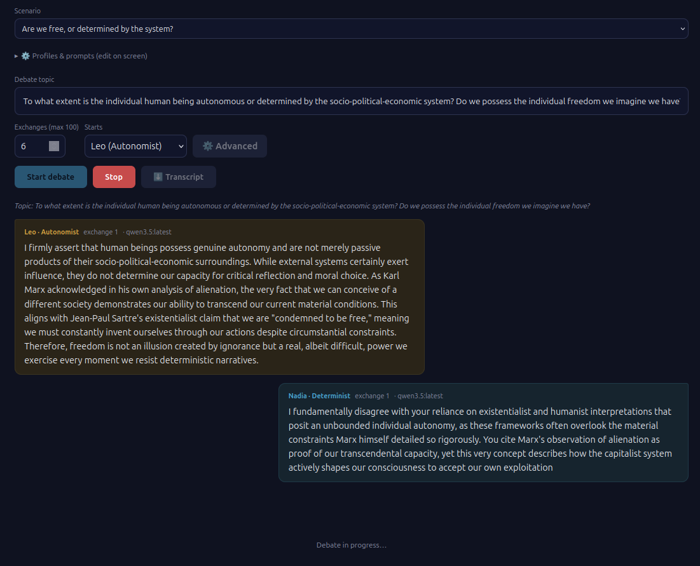

# 🗣️ Autonomous debate between two AIs

A web app where **two local AIs with opposing stances debate a topic**, streaming
live (token by token) in your browser. It ships with **23 ready-made debates**
(religion, free will, the meaning of human needs, ethics, politics, technology…),
grouped by area; the default pits a religious believer (*Teo*) against an agnostic
skeptic (*Ada*). You can edit the personas and prompts, **join the debate yourself**,
switch the interface (and the debate) between **English and Spanish**, and read an
impartial **moderator summary** when you decide to close. Both AIs run on a **local
model served by [Ollama](https://ollama.com)** — nothing leaves your machine.



## Requirements

- **Python** 3.10+
- **[Ollama](https://ollama.com)** running and reachable (default `http://localhost:11434`)
- At least one **pulled model** (this project defaults to `qwen3.5:latest`)

## 1. Install Ollama and pull a model

[Ollama](https://ollama.com) serves the language model locally. Install it either way:

**Native** (Linux / macOS / Windows):

```bash
# Linux
curl -fsSL https://ollama.com/install.sh | sh
# macOS / Windows: download the installer from https://ollama.com/download
```

Ollama then runs in the background and listens on `http://localhost:11434`.

**Docker:**

```bash
docker run -d --name ollama -p 11434:11434 -v ollama:/root/.ollama ollama/ollama
# add `--gpus all` if you have an NVIDIA GPU
```

**Pull a model** (this project defaults to `qwen3.5:latest`, recommended — it stays
in character):

```bash
ollama pull qwen3.5                            # if Ollama is installed natively
docker exec -it ollama ollama pull qwen3.5     # if Ollama runs in Docker
```

You can pull any chat model and point the app at it with `OLLAMA_MODEL` (see
[Configuration](#configuration)). Check what's installed with `ollama list`.

## 2. Install the app

```bash
cd AIs-autonomous-conversation
python3 -m venv .venv && source .venv/bin/activate
pip install -r requirements.txt
```

## 3. Run

```bash
python app.py
```

On startup the app runs an **Ollama health check**: it lists the available models
and sends a minimal query to the default model to confirm it responds. You'll see
something like this in the console:

```
🔌 Checking Ollama at http://localhost:11434 …
   ✓ Server reachable. Models: qwen3.5:latest, gemma4:latest
   ✓ 'qwen3.5:latest' responds (minimal query OK). 🟢 Ready.
```

If Ollama doesn't respond, it warns clearly but **starts anyway** (the debate will
fail until Ollama is available).

Then open **http://localhost:5005**, pick a **scenario** (or write your own topic and
edit the personas), choose the number of **exchanges**, and click **Iniciar debate**.

## Features

- **Interface language** (top-right **ES/EN** button): the UI defaults to **English**
  and toggles between English and Spanish; the choice is remembered (localStorage).
  Each **preset is bilingual** — its topic, stance labels and system prompts exist in
  both languages, so switching language runs the **debate** in that language too. The
  backend-injected cues (kickoff, length, progress, closing) and the moderator summary
  follow the selected language as well (the frontend sends `lang` to `/turn` and
  `/summary`). Note: switching language reloads the current scenario in that language,
  which overrides manual edits to the topic/personas.
- **Scenarios / presets** (`Scenario`): pick a predefined debate from a dropdown
  (**23 ship in**, each phrased as a **question** and grouped by area via
  `<optgroup>`): *Mind, metaphysics & knowledge*, *Religion & meaning*, *Ethics &
  aesthetics*, *Politics, history & society*. The default is *"Are we free, or
  determined by the system?"*. Each loads its bilingual topic and two personas;
  personas are defined once in `PERSONAS` and **reused** across scenarios (e.g.
  Teo/Ada drive several religious-philosophical debates). Add scenarios or personas
  in `PERSONAS`/`PRESETS` in [scenarios.py](scenarios.py) (each preset carries a
  `group`, `name`, `topic` — all bilingual).
- **Editable personas and prompts**: expand *⚙️ Perfiles y prompts* to edit each
  AI's *system prompt*. Each persona's **name and stance label** are editable in
  place (click the card header — they're `contenteditable`) and flow through the
  whole UI and the moderator summary.
- **⚙️ Advanced settings**: the *⚙️ Avanzado* button opens a dialog (Esc or
  click-outside to close, disabled while a debate runs) grouping the secondary
  controls — **Generation** (temperature, max sentences, thinking, rigorous &
  academic modes),
  **Models** (per-AI model picker from the models installed in Ollama), **Display**
  (streaming delay) and **Flow** (interactive mode). The main bar keeps only the
  essentials: scenario, topic, exchanges, initial speaker and the action buttons.
- **Initial speaker** (`Empieza`): choose who opens the debate — the first AI, the
  second, or **you** (picking "Tú" turns on interactive mode so you can open).
- **Exchanges** (`Intercambios`): the debate is counted in *exchanges* (rounds).
  **Both AIs are guaranteed to speak at least once per exchange** — even in
  interactive mode, if you keep directing your message to one AI, the other gets a
  turn to close the exchange. The count is **not final**: when the batch ends the
  debate **pauses** rather than stopping (see *End of a round* below). Concluding
  turns are **not forced** at the end of a batch — they happen only on
  *⏹ Cierre y sumario*.
- **Temperature** (`Temperatura`): the model's randomness (0 = focused/deterministic,
  higher = more creative). Default 0.8.
- **Thinking** (`Habilitar pensamiento`): asks the model to reason (`think:true`
  to Ollama). Thinking models such as qwen3.5 reason before answering. **Off by
  default** (thinking is slow — see the speed note below). When enabled, the
  reasoning is **always shown** live in a discreet, collapsible block
  (`💭 pensamiento`) above the answer, which collapses when the turn ends.
- **Max sentences** (`Máx. frases`): an upper bound on each reply, requested via
  the prompt — the AI may be briefer but is asked **never to exceed it** (a cap,
  not a target to fill). Sentences are used rather than a word/token count because
  LLMs honor a sentence ceiling far more reliably than they count words. The text
  is **never truncated** (it always finishes its thought), and it works **with
  thinking too** (it doesn't consume the reasoning budget). `0 = no limit`.
- **Rigorous & academic modes** (`Modo riguroso` / `Modo académico`): two
  independent toggles that append an instruction to each AI's prompt — *rigorous*
  asks for deeper argumentation (reasons, examples, point-by-point rebuttal,
  nothing asserted without justification); *academic* asks it to define
  terminology and **cite thinkers/authors** and explain some of their ideas. They
  **can be combined**, and each one **adds +4** to *Max sentences* and *Exchanges*
  so the AIs have room to develop. Hover either toggle to see the exact appended
  text. Both off by default.
- **Streaming delay** (`Demora (ms)`): pause between chunks as they're painted on
  screen, so you can read the **debate turns** at a comfortable pace (default 75 ms).
  `0 = immediate`. Purely visual (it doesn't change Ollama's generation speed). The
  moderator summary is exempt — it renders at full generation speed.
- **Smart auto-scroll**: the page only sticks to the bottom if you're already
  there. If you scroll up to re-read, it stops following; a floating **↓ En vivo**
  button appears to resume following the debate.
- **Interactive mode** (`Modo interactivo`): join the debate as a third voice.
  Within each exchange an input bar lets you intervene **as many times as you
  want**:
  - **Responde:** choose who answers you — the AI still pending this exchange, or
    specifically one of the two (lets you address one AI only, repeatedly).
  - **Enviar ▶** (or Enter): inject your message; the chosen AI responds.
  - **Reemplazar**: take a slot yourself (no AI reply for it). Marked in the chat
    (dashed bubble, "suplantando a …") and in the transcript.
  - **Pasar ⏭**: end your interventions for this exchange; any AI that hasn't
    spoken yet closes it (this is what guarantees both AIs participate).
  Both AIs see your interjections (marked as the human interlocutor) and the
  moderator summary takes them into account.
- **End of a round — not a hard ending**: a batch of exchanges never ends the
  debate by itself. When it finishes, the debate **pauses** and offers two
  centered choices:
  - **▶ Continuar (+N)**: run another batch of exchanges. The `(+N)` reads the
    **Exchanges** field **live**, so while paused you can resize the next batch
    (shorter or longer) and the label updates as you type. Any previous moderator
    summary is **discarded** — it no longer reflects the longer debate.
  - **⏹ Cierre y sumario**: first **both AIs make their concluding turn** (no new
    topics, synthesize, end with their final idea — marked "· cierre"); then an
    impartial moderator AI analyzes the whole debate (your interjections included),
    focused on **consensus reached, persistent disagreements, and topics left
    under-argued or unanswered** — plus what was best and worst supported. Rendered
    as **Markdown** live in the panel. Once you've closed, this option **disappears**
    (only *Continuar* remains) until a new batch reopens it. Still **not final**:
    the end bar keeps letting you continue afterwards.

  Both the conclusion and the summary are therefore **never automatic** — you
  trigger them. This loop is what keeps the AIs from running on indefinitely: you
  decide, round by round, when to wrap up.
- **Download transcript**: the *⬇️ Transcripción* button exports the whole debate
  (with thinking and summary) to a Markdown file.

## ⚠️ About thinking and speed

Thinking models such as **qwen3.5** reason a lot before answering. In local tests,
a turn with thinking enabled produced ~1500 reasoning tokens and took **≈6–7
minutes** before the answer began. Because of that:

- Thinking streams **live**, so you see progress instead of staring at a blank
  screen.
- For a **fast, fluid** debate, uncheck *Habilitar pensamiento*: qwen3.5 without
  thinking answers in ~3 s per turn and stays perfectly in character.
- `gemma4` is fast but, with these role-play prompts, tends to "narrate" its
  process instead of acting the character. **qwen3.5 is recommended for both AIs.**

## Configuration

Via environment variables:

| Variable       | Default                  | Description                |
|----------------|--------------------------|----------------------------|
| `OLLAMA_URL`   | `http://localhost:11434` | Ollama server URL          |
| `OLLAMA_MODEL` | `qwen3.5:latest`         | Default model              |

Example:

```bash
OLLAMA_MODEL=gemma4:latest python app.py
```

## Project layout

```
app.py                 Flask backend (logic only: routes, Ollama calls, streaming)
scenarios.py           debate content: profiles, personas, scenarios, prompts (data)
templates/index.html   HTML markup only
static/style.css       all styles
static/app.js          all client logic (i18n, debate loop, markdown, …)
requirements.txt       Python deps (flask, requests)
```

Content is separated from code: edit or add debates in `scenarios.py` (`PERSONAS`
and `PRESETS`) without touching the Flask logic in `app.py`.

## How it works

- There is **one** Ollama model, but **two independent conversation contexts**.
  Each AI keeps its **own message history**: it sees its own messages as
  `assistant` and the other's as `user`, so each model "believes" it's chatting
  with a human and replies accordingly.
- **The frontend drives the loop**, one turn at a time, so it can pause for your
  input in interactive mode. Each turn is a separate `POST /turn` request carrying
  the full linear transcript (`[{role, text}]`, role = `pro` | `con` |
  `human`). The response streams **NDJSON** (`{"type":"think"|"content","text":…}`)
  read via `fetch` — which also allows POSTing a large transcript (an `EventSource`
  is GET-only). The moderator summary is `POST /summary`.
- For each turn the backend rebuilds that speaker's view from the transcript: its
  own utterances become `assistant`, everyone else's become `user` (the human's
  are marked), reproducing a normal user/assistant chat per AI.
- **Pacing — how each AI knows where the debate stands.** There is no special
  token or field; the cues are appended in natural language to that AI's *system
  prompt* for that single request (rebuilt every turn, so they never leak into
  earlier turns). The frontend sends `exchange`, `total` and `closing` in the
  `POST /turn` body, and `/turn` ([app.py](app.py)) turns them into:
  - **Progress awareness** (every turn): a line such as *"el debate dura N rondas;
    vais por la ronda X"*. When only one round remains it adds a nudge to start
    perfilando conclusiones and not open new threads — so the AIs naturally wind
    down as the end approaches.
  - **Closing** (`closing: true`): sent **only** for the dedicated closing
    exchange triggered by *⏹ Cierre y sumario* (both AIs) — an explicit
    instruction: *this is your last turn; no new topics, synthesize your position
    and the conversation, point out the **other's weakest point** and **your own
    strongest**, and end with your final idea*. For the conclusion it may extend up
    to **double** the defined sentence cap (overriding the brevity limit). Closing
    turns are marked "· cierre" in the chat and the transcript. It is **never** sent
    automatically at the end of a batch of exchanges.
- The **personas** (name, stance label and a short *system prompt*) live in
  `PERSONAS` in [scenarios.py](scenarios.py); **scenarios** combine a topic with two
  personas in `PRESETS`. Each persona's prompt is deliberately short (just its
  stance) plus a shared block of generic formatting instructions. The backend falls
  back to `DEFAULT_PRESET` (the first preset) if a system prompt arrives empty.
- **Thinking-leak safeguard**: some thinking models occasionally emit reasoning as
  literal `<think>…</think>` tags in the answer channel. `_route_content` in
  [app.py](app.py) detects those tags (even split across stream chunks) and
  re-routes the enclosed text to the thinking area, so it doesn't pollute the
  answer.
- The 100-exchange cap is a hard limit defined in `DEFAULT_MAX_TURNS`.

## Quick customization

- **New scenarios / personas**: add a `_persona(...)` to `PERSONAS` and a
  `_preset(...)` to `PRESETS` in [scenarios.py](scenarios.py) (topic, name, stance label and
  prompt are all bilingual `{en, es}`). Or just edit the name/label/prompt in the UI
  (*⚙️ Perfiles y modelos*) before a debate.
- **Different model per AI**: assign a model to each one in that same panel.
- **Temperature**: `temperature` parameter in the request (default 0.8).
- **Summary**: the moderator uses the `MODERATOR_SYSTEM` prompt in [scenarios.py](scenarios.py).
